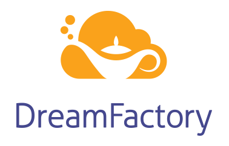

<h1 align="center">
    
</h1>

    <strong>Instant APIs without code</strong>

    <a href="https://wiki.dreamfactory.com">Docs</a> ∙ <a href="https://genie.dreamfactory.com">Try Online</a> ∙ <a href="https://github.com/dreamfactorysoftware/dreamfactory/blob/master/CONTRIBUTING.md">Contribute</a> ∙ <a href="http://community.dreamfactory.com/">Community Support</a> ∙ <a href="http://guide.dreamfactory.com/">Get Started Guide</a>

    
    
    
    

    

## Overview

DreamFactory™ is an open source REST API backend for mobile, web, and IoT applications. 
It is built on top of the Laravel framework, and includes an AngularJS-driven web administration client. So what can you do with the DreamFactory Platform?

* [Generate](http://guide.dreamfactory.com/docs/chapter03.html#generating-a-mysql-backed-api) powerful, reusable, documented APIs for SQL, NoSQL, files, email, push notifications and more in seconds.
* [Use server-side scripts](http://wiki.dreamfactory.com/DreamFactory/Tutorials/Server_Side_Scripting) to easily customize API behavior at any endpoint, for both API requests and API responses.
* [Secure every API endpoint](http://guide.dreamfactory.com/docs/chapter03.html#creating-a-role) with user management, SSO authentication, role-based access control, OAuth and Active Directory integration.

    

## Installation

* Get installed in under 5 minutes with our [Jeanie Installers](https://github.com/dreamfactorysoftware/dreamfactory/tree/3.0-beta/installers) (3.0 beta) for Ubuntu and Debian. This installs all necessary dependencies and allows more customization than Bitnami.
* [Bitnami](https://bitnami.com/stack/dreamfactory/installer) provides a point and click install process. Just download, click next-next-next and you are done!
* [Docker](http://wiki.dreamfactory.com/DreamFactory/Installation#Docker_Image) provides a dockerhub image or you can build your own.
* [Raspberry Pi](http://guide.dreamfactory.com/docs/raspberry-pi.html) allows you to configure DreamFactory as an open source IoT gateway.

Find a full list of installation options [here](http://wiki.dreamfactory.com/DreamFactory/Installation).

## Documentation

Follow along with our [Get Started Guide](http://guide.dreamfactory.com/) to configure your environment in minutes.
Documentation for the platform can be found on the [DreamFactory wiki](http://wiki.dreamfactory.com).
Our community forum can be found [here](http://community.dreamfactory.com/).

## Community 

|  |  |  |
| --------------------------------------------------------------------------------------------------------------------------------------------------------------------------------------------- | ----------------------------------------------------------------------------------------------------------------------------------------------------------------------------- | ---------------------------------------------------------------------------------------------------------------------------------------------------------------------------------------------- |
| Ask and answer StackOverflow questions with the [`dreamfactory` tag](https://stackoverflow.com/questions/tagged/dreamfactory)                                                                               | Check out our [community forum](https://community.dreamfactory.com), ask questions, and discuss project direction                                                                                           | Tweet to [`@dfsoftwareinc`](https://twitter.com/dfsoftwareinc) or with the [`#dreamfactory` hashtag](https://twitter.com/search?q=%23dreamfactory&f=live)  

## Commercial Licenses

In need of official technical support? Desire access to REST API generators for SQL Server, Oracle, SOAP, or mobile
push notifications? Require API limiting and/or auditing? Schedule a demo [with our team](https://www.dreamfactory.com/demo/)!

## Feedback and Contributions

* Feedback is welcome on our [forum](http://community.dreamfactory.com/) or in the form of pull requests and/or issues.
* Contributions should generally follow the strategy outlined in ["Contributing to a project"](http://help.github.com/articles/fork-a-repo#contributing-to-a-project).
